<div align="center">

  <!-- Custom banner: name + desk photo -->
  

  <br/><br/>

  <table align="center">
<tr border="none">
<td width="50%" align="left">
  <!-- Python Code Typing Animation -->
  <a href="https://github.com/tintin4003-ops">
    
  </a>


</td>
<td width="50%" align="center">

  

  </td>
</tr>
</table>


  <br/><br/>
  ```js
  const aboutMe = {
    background: "BSc in CSE, American International University-Bangladesh (AIUB)",
    curiosity: "Image processing — underwater image restoration & medical imaging"✨
  };
  ```

  <br/>
 
</div>

<!-- Social icons -->
<p align="center">
  <a href="https://www.linkedin.com/in/mahi-muqtadir-294428285/"></a>
  &nbsp;&nbsp;
  <a href="https://mahimuqtadir.my.canva.site"></a>
  &nbsp;&nbsp;
  <a href="https://github.com/tintin4003-ops"></a>
</p>

<br/>

<!-- Profile badges -->
<p align="center">
  <a href="https://github.com/tintin4003-ops?tab=repositories&sort=stargazers">
    </a>
  <a href="https://github.com/tintin4003-ops?tab=followers">
  
</a>
  
</p>

<br/>

 ## 📌 Featured Projects <table align="center"> <tr> <td width="33%" valign="top"> <h3><a href="https://github.com/tintin4003-ops/Toonverse">🎮 Toonverse</a></h3> A multiverse of childhood cartoons built with C++, OpenGL &amp; GLUT. <br/><br/>   </td> <td width="33%" valign="top"> <h3><a href="https://github.com/tintin4003-ops/Merchify">🛍️ Merchify</a></h3> A merchandise management system built with C#, .NET &amp; SQL Server. <br/><br/>   </td> <td width="33%" valign="top"> <h3><a href="https://github.com/tintin4003-ops/The_Baratie">🍳 The Baratie</a></h3> A Java GUI application project. <br/><br/>  </td> </tr> </table> <br/>

# 📊 GitHub Stats

<p align="center">
  
</p>

<br/>

<div align="center">
  
</div>

<br/>


<h2 align="center">🛠️ Tools and Technologies</h2>

<div align="center">

<table>
  <tr>
    <td align="center" width="120">
      
      <br>C++
    </td>
    <td align="center" width="120">
      
      <br>C#
    </td>
    <td align="center" width="120">
      
      <br>Java
    </td>
    <td align="center" width="120">
      
      <br>Python
    </td>
  </tr>

  <tr>
    <td align="center" width="120">
      
      <br>JavaScript
    </td>
    <td align="center" width="120">
      
      <br>PHP
    </td>
    <td align="center" width="120">
      
      <br>SQL
    </td>
    <td align="center" width="120">
      
      <br>.NET
    </td>
  </tr>

  <tr>
    <td align="center" width="120">
      
      <br>HTML5
    </td>
    <td align="center" width="120">
      
      <br>CSS
    </td>
    <td align="center" width="120">
      
      <br>Git
    </td>
    <td align="center" width="120">
      
      <br>GitHub
    </td>
  </tr>

  <tr>
    <td align="center" width="120">
      
      <br>VS Code
    </td>
    <td align="center" width="120">
      
      <br>Trello
    </td>
    <td align="center" width="120">
      
      <br>Figma
    </td>
    <td align="center" width="120">
      &nbsp;
    </td>
  </tr>
</table>

</div>

<br/>
<div align="center">


<br/>
</div>
